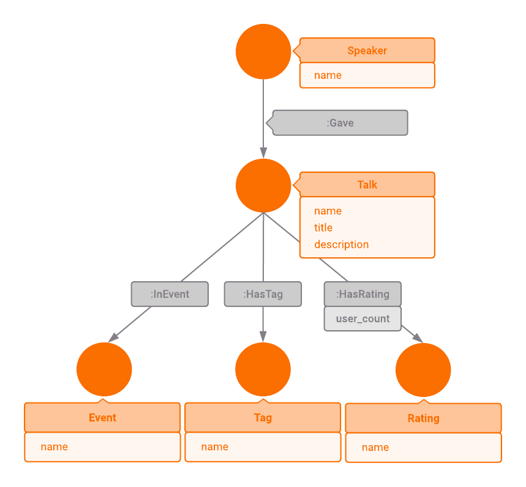

## Analyzing TED Talks

This article is a part of a series intended to show users how to use Memgraph
on real-world data and, by doing so, retrieve some interesting and useful
information.

We highly recommend checking out the other articles from this series:

  * [Exploring the European Road Network](exploring-the-european-road-network.md)
  * [Graphing the Premier League](graphing-the-premier-league.md)
  * [Movie Recommendation System](movie-recommendation.md)

### Introduction

[TED](https://www.ted.com/) is a nonprofit organization devoted to spreading
ideas, usually in the form of short, powerful talks.
Today, TED talks are influential videos from expert speakers on almost all
topics &mdash; from science to business to global issues.
Here we present a small dataset which consists of 97 talks, show how to model
this data as a graph and demonstrate a few example queries.

### Data Model

Each TED talk has a main speaker, so we
identify two types of nodes &mdash; `Talk` and `Speaker`. Also, we will add
an edge of type `Gave` pointing to a `Talk` from its main `Speaker`.
Each speaker has a name so we can add property `name` to `Speaker` node.
Likewise, we'll add properties `name`, `title` and `description` to node
`Talk`. Furthermore, each talk is given in a specific TED event, so we can
create node `Event` with property `name` and relationship `InEvent` between
talk and event.

Talks are tagged with keywords to facilitate searching, hence we
add node `Tag` with property `name` and relationship `HasTag` between talk and
tag. Moreover, users give ratings to each talk by selecting up to three
predefined string values. Therefore we add node `Rating` with these values as
property `name` and relationship`HasRating` with property `user_count` between
talk and rating nodes.



### Importing the Snapshot

We have prepared a database snapshot for this example, so the user can easily
import it when starting Memgraph using the `--durability-directory` option.

```bash
/usr/lib/memgraph/memgraph --durability-directory /usr/share/memgraph/examples/TEDTalk \
  --durability-enabled=false --snapshot-on-exit=false
```

When using Memgraph installed from DEB or RPM package, the currently running
Memgraph server may need to be stopped before importing the example. The user
can do so using the following command:

```bash
systemctl stop memgraph
```

When using Docker, the example can be imported with the following command:

```bash
docker run -p 7687:7687 \
  -v mg_lib:/var/lib/memgraph -v mg_log:/var/log/memgraph -v mg_etc:/etc/memgraph \
  memgraph --durability-directory /usr/share/memgraph/examples/TEDTalk \
  --durability-enabled=false --snapshot-on-exit=false
```

The user should note that any modifications of the database state will persist
only during this run of Memgraph.

### Example Queries

1) Find all talks given by specific speaker:

```opencypher
MATCH (n:Speaker {name: "Hans Rosling"})-[:Gave]->(m:Talk)
RETURN m.title;
```

2) Find the top 20 speakers with most talks given:

```opencypher
MATCH (n:Speaker)-[:Gave]->(m)
RETURN n.name, COUNT(m) AS TalksGiven
ORDER BY TalksGiven DESC LIMIT 20;
```

3) Find talks related by tag to specific talk and count them:

```opencypher
MATCH (n:Talk {name: "Michael Green: Why we should build wooden skyscrapers"})
      -[:HasTag]->(t:Tag)<-[:HasTag]-(m:Talk)
WITH * ORDER BY m.name
RETURN t.name, COLLECT(m.name), COUNT(m) AS TalksCount
ORDER BY TalksCount DESC;
```

4) Find 20 most frequently used tags:

```opencypher
MATCH (t:Tag)<-[:HasTag]-(n:Talk)
RETURN t.name AS Tag, COUNT(n) AS TalksCount
ORDER BY TalksCount DESC, Tag LIMIT 20;
```

5) Find 20 talks most rated as "Funny". If you want to query by other ratings,
possible values are: Obnoxious, Jaw-dropping, OK, Persuasive, Beautiful,
Confusing, Longwinded, Unconvincing, Fascinating, Ingenious, Courageous, Funny,
Informative and Inspiring.

```opencypher
MATCH (r:Rating{name:"Funny"})<-[e:HasRating]-(m:Talk)
RETURN m.name, e.user_count ORDER BY e.user_count DESC LIMIT 20;
```

6) Find inspiring talks and their speakers from the field of technology:

```opencypher
MATCH (n:Talk)-[:HasTag]->(m:Tag {name: "technology"})
MATCH (n)-[r:HasRating]->(p:Rating {name: "Inspiring"})
MATCH (n)<-[:Gave]-(s:Speaker)
WHERE r.user_count > 1000
RETURN n.title, s.name, r.user_count ORDER BY r.user_count DESC;
```

7) Now let's see one real-world example &mdash; how to make a real-time
recommendation. If you've just watched a talk from a certain
speaker (e.g. Hans Rosling) you might be interested in finding more talks from
the same speaker on a similar topic:

```opencypher
MATCH (n:Speaker {name: "Hans Rosling"})-[:Gave]->(m:Talk)
MATCH (t:Talk {title: "New insights on poverty"})-[:HasTag]->(tag:Tag)<-[:HasTag]-(m)
WITH * ORDER BY tag.name
RETURN m.title as Title, COLLECT(tag.name), COUNT(tag) as TagCount
ORDER BY TagCount DESC, Title;
```

The following few queries are focused on extracting information about
TED events.

8) Find how many talks were given per event:

```opencypher
MATCH (n:Event)<-[:InEvent]-(t:Talk)
RETURN n.name as Event, COUNT(t) AS TalksCount
ORDER BY TalksCount DESC, Event
LIMIT 20;
```

9) Find the most popular tags in the specific event:

```opencypher
MATCH (n:Event {name:"TED2006"})<-[:InEvent]-(t:Talk)-[:HasTag]->(tag:Tag)
RETURN tag.name as Tag, COUNT(t) AS TalksCount
ORDER BY TalksCount DESC, Tag
LIMIT 20;
```

10) Discover which speakers participated in more than 2 events:

```opencypher
MATCH (n:Speaker)-[:Gave]->(t:Talk)-[:InEvent]->(e:Event)
WITH n, COUNT(e) AS EventsCount WHERE EventsCount > 2
RETURN n.name as Speaker, EventsCount
ORDER BY EventsCount DESC, Speaker;
```

11) For each speaker search for other speakers that participated in same
events:

```opencypher
MATCH (n:Speaker)-[:Gave]->()-[:InEvent]->(e:Event)<-[:InEvent]-()<-[:Gave]-(m:Speaker)
WHERE n.name != m.name
WITH DISTINCT n, m ORDER BY m.name
RETURN n.name AS Speaker, COLLECT(m.name) AS Others
ORDER BY Speaker;
```
